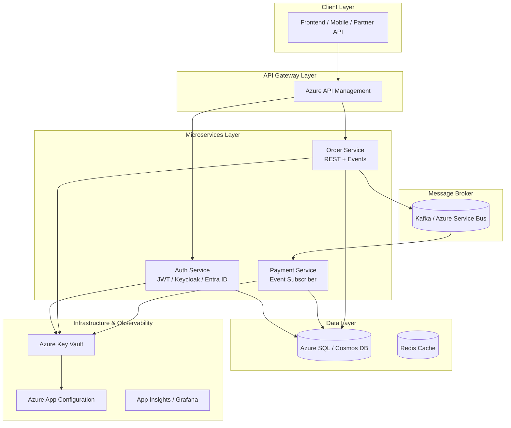

# Step-by-Step Microservices Roadmap (Azure + Kafka / Service Bus)

## Phase 0 — Foundations

### Goal:
Understand the principles of microservice architecture and Azure components.

### Learn:
- Microservices concepts: loose coupling, bounded context, scalability.
- 12-Factor App methodology.
- Azure Core Services:
  - Azure Functions / App Service
  - Azure Service Bus / Event Hubs
  - Azure API Management
  - Azure Key Vault / App Configuration

### Tools:
VS Code / IntelliJ, Docker Desktop, Azure CLI, Functions Core Tools, Postman.

## Phase 1 — Core Microservice Setup

### Goal:
Create independent REST-based microservices.

### Build:
- **Auth Service** — JWT/OAuth2 with Keycloak or Entra ID  
- **Order Service** — CRUD + validation  
- **Payment Service** — triggered by events  

Each with:
- Own database (Azure SQL / Cosmos DB)
- REST API documented with OpenAPI / Swagger

### Deliverable:
- 3 isolated microservices with separate databases and REST APIs.

## Phase 2 — Asynchronous Communication

### Goal:
Decouple services with message brokers.

### Build:
- Use **Azure Service Bus** or **Kafka**
- Publish/Subscribe model:
  - `order-service` publishes → "OrderCreated"
  - `payment-service` subscribes → processes payment
- Handle retries, idempotency, and DLQs (Dead Letter Queues)

### Deliverable:
- Event-driven order-payment flow using Service Bus or Kafka.

## Phase 3 — Infrastructure & Deployment

### Goal:
Containerize and deploy to Azure.

### Steps:
1. Dockerize each service  
2. Push images to **Azure Container Registry (ACR)**  
3. Deploy via **Azure Container Apps** or **AKS**  
4. Configure networking and environment variables  

### Deliverable:
- Microservices running in Azure Containers with event communication.

## Phase 4 — Security & Configuration

### Goal:
Secure APIs, secrets, and configs.

### Steps:
- Manage secrets in **Azure Key Vault**
- Centralize configs in **Azure App Configuration**
- Protect APIs with **Azure API Management**
- Integrate OAuth2 with **Keycloak / Entra ID**

### Deliverable:
- Secure APIs and centralized configuration setup.

## Phase 5 — Observability & Monitoring

### Goal:
Implement logs, metrics, and tracing.

### Steps:
- Logging: Azure Application Insights / ELK
- Metrics: Azure Monitor / Grafana
- Tracing: OpenTelemetry + Application Insights
- Correlation IDs across services

### Deliverable:
- Centralized logs, metrics dashboards, and distributed traces.

## Phase 6 — CI/CD & Scaling

### Goal:
Automate build and deploy processes.

### Steps:
- Setup CI/CD with **GitHub Actions / Azure DevOps**
- Build → Test → Deploy pipeline
- Autoscale via Azure Container Apps / AKS
- Canary / Blue-Green deployments

### Deliverable:
- Automated deployment pipeline and scalable microservices.

## Mermaid Architecture Diagram

    INSIGHTS --> APIM
    INSIGHTS --> SERVICES
